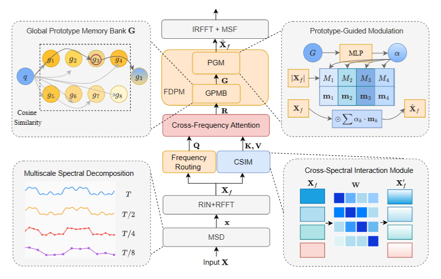

# SpectraGuard

Official PyTorch implementation of **SpectraGuard: Multi-Scale Frequency-Domain Anomaly Detection with Shared Prototype Memory**.

> SpectraGuard is a multi-scale frequency-domain anomaly detection framework that leverages shared prototype memory and channel similarity modulation (CSIM) to capture both local window semantics and global periodic patterns in time series data.

<p align="center">
  
</p>

## Requirements

- Python 3.8+
- CUDA-capable GPU (recommended)

Install dependencies:

```bash
pip install -r requirements.txt
```

## Data Preparation

Download the datasets and place them under `./dataset/`:

```
dataset/
├── MSL/
│   ├── MSL_train.npy
│   ├── MSL_test.npy
│   └── MSL_test_label.npy
├── SMAP/
│   └── SMAP/
│       ├── SMAP_train.npy
│       ├── SMAP_test.npy
│       └── SMAP_test_label.npy
├── SMD/
│   └── SMD/
│       ├── SMD_train.npy
│       ├── SMD_test.npy
│       └── SMD_test_label.npy
├── PSM/
│   └── PSM/
│       ├── train.csv
│       ├── test.csv
│       └── test_label.csv
└── SWaT/
    ├── SWAT_train.npy
    ├── SWAT_test.npy
    └── SWAT_test_label.npy
```

All datasets are publicly available. We follow the same preprocessing as [Anomaly-Transformer](https://github.com/thuml/Anomaly-Transformer).

## Training and Evaluation

### Run all datasets

```bash
bash run_all.sh
```

### Run a single dataset

```bash
python train_spectraguard.py --dataset <DATASET>
```

where `<DATASET>` is one of `SMD`, `MSL`, `SMAP`, `PSM`, `SWAT`.

### Hyperparameters

| Argument | Default | Description |
|---|---|---|
| `--dataset` | required | Dataset name |
| `--epochs` | 3 | Number of training epochs |
| `--batch_size` | 256 | Batch size |
| `--lr` | 1e-4 | Learning rate |
| `--win_size` | 100 | Sliding window size |
| `--scales` | 2 4 8 | Multi-scale downsampling ratios |

Example with custom hyperparameters:

```bash
python train_spectraguard.py \
    --dataset SMD \
    --epochs 5 \
    --batch_size 128 \
    --lr 5e-5 \
    --win_size 100 \
    --scales 2 4 8
```

Results are saved to `./results/`.

## Project Structure

```
SpectraGuard/
├── model/
│   ├── MultishareprotoG.py     # Multi-scale model with shared prototype memory
│   ├── FITS.py                  # Frequency interpolation module
│   ├── freq_proto.py            # Frequency prototype components
│   ├── csim.py                  # Channel Similarity Modulation (CSIM)
│   └── basis_upsampler.py       # Frequency-selective basis-guided upsampler
├── data_factory/
│   └── data_loader.py           # Dataset loaders
├── train_spectraguard.py        # Training and evaluation script
├── run_all.sh                   # Run all datasets
├── requirements.txt
└── README.md
```

## Citation

If you find this work useful, please cite our paper:

```bibtex
@article{spectraguard2026,
  title={SpectraGuard: Multi-Scale Frequency-Domain Anomaly Detection with Shared Prototype Memory},
  author={Your Name and Co-authors},
  journal={Conference/Journal Name},
  year={2026}
}
```

## Acknowledgement

We appreciate the following repositories for their open-source contributions:

- [Anomaly-Transformer](https://github.com/thuml/Anomaly-Transformer)
- [FITS](https://github.com/VEWOXIC/FITS)

## License

This project is released under the MIT License.
